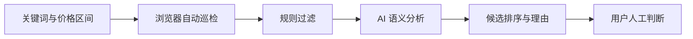

# 项目作品集

这里汇总了四个已经做出可运行版本的项目。它们分别关注复杂决策、空窗期生活管理、信息筛选和多角色 AI 交互，覆盖产品设计、前后端开发、AI 工作流、数据安全与真实环境验证。

## 快速了解

| 项目 | 解决的问题 | 主要功能 | 工程关键词 |
| --- | --- | --- | --- |
| [**Astraloom**](https://github.com/cheng-Lokesh/Astraloom) | 普通 AI 难以解释复杂现实问题，结论缺少过程和依据 | 现实信息整理、关键人物、Agent、关系图谱、情景模拟、历史与反馈 | 多智能体、证据链、Supabase RLS、数据隔离 |
| [**空窗期生存系统**](https://github.com/cheng-Lokesh/buffer) | 待业或转型阶段的现金、行动和变化信息彼此割裂 | 现金现状、未来轨迹、保留边界、条件管理、变化记录与情景对照 | 本地优先、确定性计算、响应式 Web、微信小程序 |
| [**TradeSniper**](https://github.com/cheng-Lokesh/tradesniper) | 二手平台需要反复搜索，商家信息和无效结果干扰判断 | 关键词巡检、价格过滤、卖家识别、AI 辅助排序、桌面监控 | Playwright、规则与模型协同、Tkinter、会话管理 |
| [**星夜伴侣**](https://github.com/cheng-Lokesh/StarNight_Companion) | 通用聊天缺少稳定人设、场景感和连续记忆 | 多角色对话、场景切换、独立记忆、语音、情绪反馈与导出 | 上下文编排、Zustand 持久化、TTS、响应式交互 |

---

## 01 · Astraloom

> 把复杂现实处境整理成可以检查、回溯和继续修正的多角色情景模拟。

### 主要功能

- 将用户提供的现实材料整理为目标、约束、事实和待确认信息。
- 提取关键人物，为不同角色生成独立的 Agent Profile。
- 用关系图谱表达人物之间的支持、压力、冲突和影响关系。
- 锁定图谱快照后运行情景模拟，保留事件过程、结果和账户历史。
- 支持对结果补充反馈，为后续观察和校准留下依据。

### 专业性与工程重点

- **结论可追溯**：重要结论关联具体事件，而不是只生成一篇看似合理的长文本。
- **输入可复现**：模拟使用确认后的关系图谱快照，避免运行过程中输入悄悄变化。
- **数据隔离**：通过 Supabase Auth、PostgreSQL 与 Row Level Security 保护账户数据。
- **安全控制**：区分事实、推断与未知信息；高风险内容在生成前进入保守处理流程。

`Next.js 16` `React 19` `TypeScript` `Supabase` `Multi-Agent` `Knowledge Graph` `Explainable AI`

[查看完整项目说明 →](https://github.com/cheng-Lokesh/Astraloom)

---

## 02 · 空窗期生存系统

> 帮助待业、转型和项目空窗期的人看清现金现实，并把未来压力转化为可以处理的行动。

### 主要功能

- 通过现金、保留边界和最低支出三个关键数字建立当前状态。
- 计算可支撑天数，并展示 30、60、90 天现金变化轨迹。
- 管理持续有效的现实条件，记录已经发生的收入、支出和状态变化。
- 对不同支出或收入方案进行情景对照，但不会把模拟结果写回真实数据。
- 提供本地备份、恢复、响应式 Web 与微信小程序实现。

### 专业性与工程重点

- **不编造数据**：不知道的金额保持“未确认”，不会自动当成零，也不会补全不存在的信息。
- **现实与模拟分离**：真实记录、未来推演和临时情景使用不同的数据边界。
- **本地优先**：基础数据默认保存在用户设备中，无需注册即可使用和恢复。
- **跨端一致性**：Web 与微信小程序共享核心计算逻辑，并为服务端权益设置独立校验边界。

`React 19` `Vite 7` `JavaScript` `Cloudflare Workers` `LocalStorage` `微信小程序` `Playwright`

[查看完整项目说明 →](https://github.com/cheng-Lokesh/buffer)

---

## 03 · TradeSniper

> 用自动化和 AI 减少二手商品筛选中的重复浏览，把海量结果缩小为值得人工判断的候选列表。

### 主要功能

- 根据关键词和价格区间自动巡检商品列表。
- 维护浏览器登录会话，支持前台调试和后台无头运行。
- 使用关键词、库存模式和价格异常等规则识别疑似职业卖家。
- 调用 DeepSeek 对候选商品描述进行语义分析，并给出排序理由。
- 在 Tkinter 桌面面板中显示运行日志、过滤过程和候选结果。

### 专业性与工程重点

- **规则先于模型**：先用稳定、低成本的规则缩小范围，再调用模型处理更需要语义判断的内容。
- **人工保留最终决定**：AI 只负责辅助筛选，不自动下单、不代替验货，也不承诺交易收益。
- **模块化结构**：采集、规则、模型分析、配置和界面相互分离，便于适配页面变化。
- **可观察运行**：桌面界面持续显示当前任务、异常和候选结果，避免自动化成为黑盒。

`Python` `Playwright` `Tkinter` `DeepSeek API` `Automation` `Threading`

[查看完整项目说明 →](https://github.com/cheng-Lokesh/tradesniper)

---

## 04 · 星夜伴侣

> 一个支持多角色、场景、语音和本地记忆的 AI 角色聊天 Web 应用。

### 主要功能

- 提供五个具有不同人设、语气和视觉形象的预设角色。
- 支持日常、校园、浪漫、冒险、悬疑和奇幻等场景上下文。
- 每个角色维护独立会话和本地记忆，切换角色时不会混用历史。
- 集成 MiniMax 对话与语音合成，并提供轻量情绪反馈。
- 支持多会话管理，以及 JSON、TXT、Markdown 格式导出。

### 专业性与工程重点

- **上下文编排**：角色设定、当前场景和历史会话共同进入每轮请求，减少人设漂移。
- **独立状态管理**：使用 Zustand 管理不同角色和会话，并在浏览器中持久化。
- **前后端边界**：通过 Next.js Route Handlers 封装聊天、语音和健康检查接口。
- **多端体验**：桌面与移动端共享同一套交互逻辑，并处理异步加载、错误和语音状态。

`Next.js 16` `React 19` `TypeScript` `Zustand` `Tailwind CSS` `Framer Motion` `MiniMax TTS`

[查看完整项目说明 →](https://github.com/cheng-Lokesh/StarNight_Companion)
