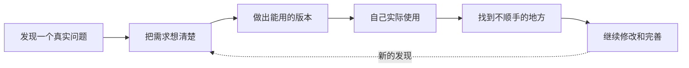

# 你好，我是 Lokesh

### 我在做 AI 产品，也喜欢把自己的想法真正做出来

我喜欢研究那些听起来很复杂、但确实会困扰人的问题，然后把它们做成可以实际使用的产品。

这里的项目大多来自我自己的观察和需求：有人在空窗期不知道每天该先做什么，有人面对复杂关系时需要理清线索，也有人只是想少花一点时间重复筛选信息。我会从需求梳理开始，一直做到界面、前后端、数据和 AI 功能，再放到真实环境里反复试用。

对我来说，AI 不是为了让产品显得更“智能”，而是应该在合适的地方帮人看清信息、减少重复劳动，或者更安心地做决定。

## 我能做什么

| 方向 | 我关注的问题 | 实践方式 |
| --- | --- | --- |
| **产品设计** | 把一个模糊想法整理成清楚、顺手的使用流程 | 需求梳理、原型、界面设计、用户路径 |
| **AI 应用** | 判断 AI 适合解决哪一部分问题，并让结果有依据 | Agent、关系图谱、结构化输出、上下文设计 |
| **全栈开发** | 独立把想法做成可以运行的 Web 或桌面产品 | React / Next.js、TypeScript、Python、Supabase、Cloudflare |
| **测试与改进** | 不只看页面能不能打开，还会检查数据、异常情况和真实使用体验 | 自动化测试、浏览器验证、隐私与安全检查 |

## 代表项目

### [Astraloom｜把复杂处境整理成可以复盘的情景模拟](https://github.com/cheng-Lokesh/Astraloom)

这是我目前投入最多的项目。它会把一段复杂的现实经历整理成关键人物、关系和事件，再模拟不同的变化方向。它不负责“预测命运”，而是希望帮助人看见自己忽略的线索，并知道每个结论是怎么来的。

`Next.js` `TypeScript` `Supabase` `Multi-Agent` `Knowledge Graph` `Explainable AI`

### [空窗期生存系统](https://github.com/cheng-Lokesh/buffer)

这是为待业、转型和项目空窗期做的个人工具。它把现金还能支撑多久、投过哪些岗位、项目推进到哪里，以及今天最该做什么放在一起，帮助人在压力比较大的阶段少一点混乱。

`React` `Vite` `微信小程序` `Cloudflare Workers` `Product Design`

### [TradeSniper｜二手商品智能监控工具](https://github.com/cheng-Lokesh/tradesniper)

我想减少在二手平台反复搜索和筛选商品的时间，所以做了这个桌面工具。它会自动巡检关键词，先用规则过滤明显不合适的结果，再让 AI 帮忙整理值得进一步查看的候选商品。

`Python` `Playwright` `Tkinter` `Automation` `LLM`

### [星夜伴侣｜多角色 AI 聊天应用](https://github.com/cheng-Lokesh/StarNight_Companion)

这是一个多角色 AI 聊天应用。我用它尝试解决角色容易“聊着聊着就变了”的问题，并把场景、历史对话、语音和界面反馈组合成更连贯的聊天体验。

`Next.js` `React` `TypeScript` `Zustand` `TTS`

## 我平时怎么做项目

- 先弄清楚问题是不是真的存在，再决定要不要做、该怎么做。
- 尽快做出一个能用的版本，亲自使用，再根据实际问题修改。
- AI 给出的内容不能只看起来合理，重要结果应该能找到来源。
- 我会认真处理移动端、异常情况、数据隐私和后续维护，而不只做一张好看的页面。

## 最近在关注

我最近主要在做 AI 原生产品、多角色协作、可解释的情景模拟和个人决策工具，也在继续学习怎么把一个想法更快、更稳地做成真正有人愿意使用的产品。
